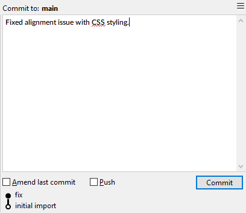
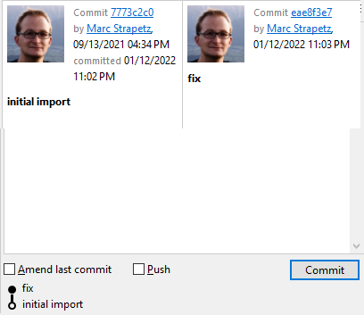

# Commit View

The Commit View in SmartGit is used to create new commits on the currently checked out Branch or HEAD, as well as to show important commit audit and metadata about an existing commit in the repository.

The layout of the **Commit** view depends on the **Graph** selection:

### Create New Commit

If the *working tree* node is selected, it shows :

- a field to compose the message for the next commit
- options available in the current context
- a **Commit** button to actually perform the commit, with the option to instead *Amend* the previous commit.

*SmartGit Commit View - Adding new Commit*

### View Existing Commit

However, if a commit is selected, it shows details for the selected commit:

- **branches** and **tags** shows all branch/tag-refs which are displayed in the **Graph** for the selected commit.
- **same state tags** (only File Logs) shows those tags which contain the file with exactly the same content as for the selected commit; this category will only be present if **Tag-Grouping** has been configured in the **Repository Settings** (for details refer there).
- **closest tags** shows those tags for a commit: - from which the commit is reachable; and
    - from which there is no other tag reachable from which the commit is reachable, too. In addition, more relevant tags will be added if **Tag-Grouping** has been configured in the [**Repository Settings**](Repository/Repository-Settings.md).
- **on branches** shows all branch-refs for which the selected commit is an ancestor reachable by following only "primary" parents, i.e. is part of the branch's "natural" history
- **merged to branches** shows all branch-refs for which the selected commit is an ancestor, but only reachable by following at least one merge parent (2nd or higher parent of a commit)

*SmartGit Commit View - Viewing existing Commits*

#### Tip

> As per the above image, you can select up to 2 Commits - the Commit View will show both commits.

## Variations of the Commit View

- When using the [Standard Window](Standard-Window.md), the Commit View will also show an exerpt of the 'Journal' beneath the view.
