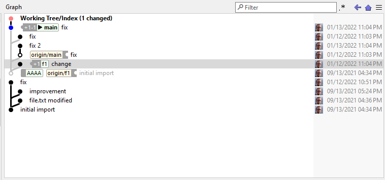

# Graph View

The **Graph** displays the log graph ("history") starting from the selected **Branches** anchors. Branches/tags and other *refs* will show up at the "appropriate" commits. In case of File (or Subtree) Logs or filtered Logs (see **Filter** input field, below), every *ref* will be mapped to the most recent commit of the graph which is still part of the ref's history. In case of File (or Subtree) Logs, the file (or subtree) content of the mapped ref commit will be identical to the content of the actual commit to which the refs points. For filtered Logs, when there is no relation between the mapped commit and the actual commit, you will still be able to see which of your filtered commits are part of which ref's history. Mapped refs which are not located exactly at the commit to which they are attached will be denoted by `~`.

The **Graph** can be customized in many ways from the *Options*-menu `(≡)`.

*Graph View in the Log Window, with the Recyclable Commits option enabled*

### Graph filter

Using the **Filter** field above the **Graph**, you can restrict the displayed commits to those matching a certain filter criterion. On change of the **Filter** field, SmartGit will restart the search from the selected **Branches** and report matching commits bit by bit. The search will be performed directly in the repository, so eventually SmartGit will find all matching commits in the entire repository.

## Variants of the Graph View

- Query Log (dialog)
- Log Window (Main Window)
- The Graph Window in the Standard Window is similar, as there is no Branches View, you only have the option of visualizing the current branch, or all branches, when the 'My History' tab is open.
