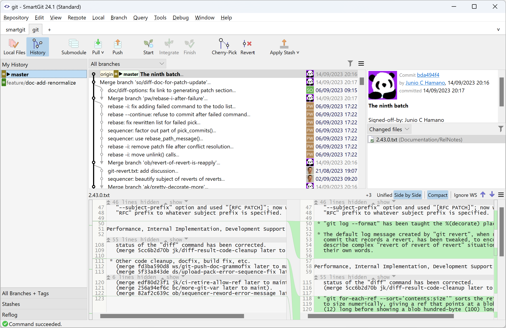

---
redirect_from:
  - /SmartGit/Latest/Main-Windows
  - /SmartGit/Latest/Main-Windows.html
---
# Main Windows

SmartGit comes with three different main windows that all can execute Git commands:

- The [Working Tree Window](#working-tree-window) focuses on a file-centric display of changes; it also shows the **Journal**, a small log of the latest commits in the current branch, and a baseline/comparative branch (e.g., for cherry-picking).
- The [Log Window](#log-window) emphasizes the commit graph history, displaying local changes as a separate node attached to the HEAD.
- The [Standard Window](#standard-window) simplifies workflows by combining a file-centric **Local Files** view with a graph-based **History** view of the repository.

You can specify your preferred window in two ways:

1. During the *Setup wizard*:

  

2. After setup, through the *Preferences* (Edit \| Preferences). 

  

### Using Multiple Windows

You can use all three main windows simultaneously, but you can configure the default one in the Preferences. For example, the default window is used when you open a repository using the command line.

### Rearrange Views

You can rearrange the views by dragging their titles in the Working Tree and Log windows. To place multiple views into one tab group, drag a view onto the center of another view. To restore the default layout, use **Window \| Reset Perspective**. Each of these windows can remember two different layouts (called perspectives). You can switch between them using **Window \| Main Perspective** and **Window \| Review Perspective**.

## Working Tree Window
**TODO** Annotate the Working Tree Window image highlighting the various areas discussed.

The Working Tree window focuses on the files *changed* of your working tree.
Selecting a file will show the differences made the previous commit in the *Changes view*.

The *Journal View* shows the latest commits in the current branch and one optional other branch (e.g., to cherry-pick commits from). To see the full history of the repository, you need to open the [Log window](#log-window).

## Log window

**TODO** - need to annotate the below image and highlight the Repository View, Graph View, Commit View, Files View, Branch View and Changes View areas on the screen.

The Log window focuses on your repository's commits but also allows you to use the **Working Tree \| Index** node to operate on local changes.

If a commit is selected, the *Files view* shows the files from the commit.
Selecting a file will show its committed changes in the *Changes view*.

If the **Working Tree/Index** node is selected at the top of the commit tree, the *Files view* shows the files from the index and working tree.
Selecting a file will display its index or working tree changes.

Use the checkboxes in the *Branches view* to control what is displayed in the *Graph view*.
The *Recyclable Commits* checkbox at the bottom of the *Branch view* will display all commits no longer accessible from a branch or tag. This can be useful for accessing "lost" commits.

## Standard window

**TODO** Annotate the standard window layout highlighting the components.

The Standard window focuses on simpler work-flows.

The two toolbar buttons on the top left of the screen allow switching between the following views:
- The *Local Files* button displays the working tree and index files.
- The *History* button displays the history graph.
