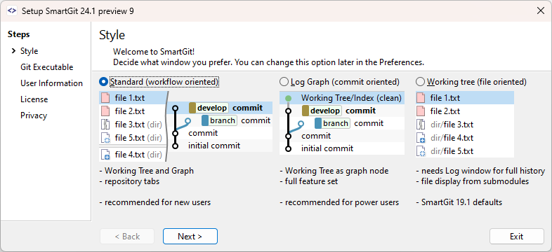
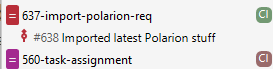

# SmartGit 24.1 Window Comparison 
## Goal of this Document
Provide a documentation/comparison for our Website and serve as a script for a Video to explain the differences to users

## Status
Internal open for discussion

## Summary
### Standard window
Workflow oriented
### Log window
Commit oriented
### Working Tree window
File oriented

## Intention
### Standard window
- Provide a rather restricted/constrained UI around Git best practices to
	- avoid some potential problematic situations
	- make it easier for organizations that need to document and certify their processes
- simple for new Git users and powerful for power users
- advanced GitHub integration features
- configuration only were necessary, e.g. toolbars optimized for different views
- make common workflows easier (=> less common workflows may be somewhat harder)
### Log window
- all features for power users with full freedom
- "get complex tasks done with ease" [MS: that is true for all windows; but specifically in comparison with the other windows I disagree]
### Working Tree window
- provide an intuitive interface if you are used to work in a file system oriented fashion

## Introduced in Version
### Standard window

### Log window

### Working Tree window

## User Interface
### Standard window
- Working Tree ("Local Files") separated from Graph ("History")
- Repositories are organized as tabs
- Start/Integrate/Finish as a guided and as safe as possible way to contribute to feature branch based workflows
	- you are fully responsible for your feature branch commits
	- conflicts need to be solved before finish (conflict-free merge)
- Reduced options for Git commands (see "common workflows should be more easy")
- Reduced orthogonal customization options (e.g. for Branches view, Graph)
### Log window
- History is the primary focus
- Working Tree as graph node
- Full feature set
- Full options for Git commands
- Compact submodule display, not recursive
- Many orthogonal customization options (e.g. for Branches view, Graph)
### Working Tree window
- Working Tree is the primary focus
- History only in the Journal, as focused view of the HEAD's history
- focus on the currently changed files
- Needs Log window for full history
- (Almost) Full feature set
- File display from submodules
- Full options for Git commands (same as for Log)

## Target Users
### Standard window
- New Users (less experienced Git users)
- Power Users (who want to avoid pitfalls)
- Organizations that need to prove/document how they use Git
### Log window
- Power Users (experienced Git users who prefer more freedom)
- “Merge Meisters”
### Working Tree window
- Power User (with focus on local (changed) files)
- Submodule Users

## Key Features
### Standard window
- Intelligent Pull (local tracking branches will be updated) 
- Less options for many Git operations, e.g. Pull/Push without dialog
- Optimized to be used with Pull Request/Merge Requests
	- Simplified Integrate/Rebase - e.g.: Integrate will automatically pull the main branch
	- Finish can directly interact with GitHub to create a pull request
- Different graph views for different workflow stages
	- My History: (my) local branches
	- All Branches and Tags: to have access to all refs
	- Stashes: to look inside stashes
	- Reflog: to see the HEAD's reflog
### Log window
- Flexible history oversight (fine-granular selection of Graph roots)
        - Various configuration options for graph display
### Working Tree window
- strong focus on file system information
- Journal is an optimized History display

## Guided Workflows
### Standard window
- Best Practice Feature Branch Support (similar to Git-Flow's feature branches, but more stream-lined)
- Optimized for single remotes
### Log window
- Fully featured GitFlow support
- More complex branching strategies
- Multi Remote Support
### Working Tree window
- Fully featured GitFlow support
- Multi Remote Support

## Integrations
### Standard Window/Log Window/Working Tree Window
- Jira and [.gitbugtraq](https://github.com/mstrap/bugtraq)
- Jenkins
- Teamcity
## Hosting Provider Support
### Standard window
- Clone Wizard
- PR and CI for [GitHub](https://github.com/)
	- Existing Pull requests are visualized below the branches
	- Results from GitHub Actions (Continuous Integration) are visualized next to the branch
	  

### Log window
- Clone Wizard   
- PR for most common hosting providers
### Working Tree window
- Clone Wizard
- Basic hosting provider integration for most common (requires the Log)

## Advanced Feature Support [MS: is this section necessary or better inline in other sections?]
### Standard window
- Enhanced GitHub PR and Actions Integration
### Log window
- perfect for complex merge jobs
- ability to see all "recyclable commits"
- Subtree support
### Working Tree window
- Very suitable for Submodules, especially its setup
- Subtree support

## Learning
### Standard window
- Less options faster to learn
- Easiest for roll out in larger organizations
### Log window
- Somewhat closer to command line Git

### Working Tree window
- Somewhat closer to command line Git

## Customization
### Standard window
- toolbars (different for different views) allow to show/hide buttons at fixed positions
### Log window
- toolbar can be freely organized
- views can be placed freely and stored as two perspectives
- Graph can be customized in various ways
### Working Tree window
- toolbar can be freely organized
- views can be placed freely and stored as two perspectives
