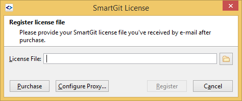

# Register a SmartGit license

After purchasing a SmartGit license, you will receive a `.lic` file.
To register this license file,
- save the license file from the email to your file system,
- open SmartGit,
	- invoke **Help\|Register** and select the **License File** there

Click **Register** and SmartGit will confirm the license details.

> [!NOTE]
> `.lic` files are binary files.
> They are not expected to be *opened* by the user, except to be registered in SmartGit.

