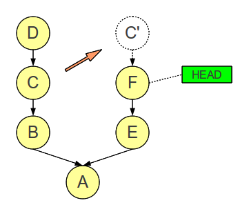

# How to perform a cherry-pick

A cherry-pick allows you to take the changes from a single commit of
another branch and apply these changes on top of the current branch.
This operation is illustrated below:

Here, we have two branches and our HEAD is at commit F. Now we want to
take the changes made in commit C and apply them on top of F.

In SmartGit, you can perform a cherry-pick from any of the three main windows -- the **Standard Window**, the **Log Window**, or the **Working Tree Window**.
In all cases, first check out the branch that contains commit F.

-   **Standard Window**: In the **Graph** view, right-click the commit to cherry-pick from.
    From the context menu, select **Cherry-Pick**.
    On the following dialog, choose whether to apply the changes to the **Working Tree** only, or apply and **Commit** as well.
-   **Log Window**: In the **Graph** view, right-click the commit to cherry-pick from.
    From the context menu, select **Cherry-Pick**.
    On the following dialog, choose whether to apply the changes to the **Working Tree** only, or apply and **Commit** as well.
-   **Working Tree Window**: From the main menu, select **Branch\|Merge**.
    In the Merge dialog, select the commit to cherry-pick from, then select **Only the selected commits (cherry-pick)**.
    Click **Merge** to perform the cherry-pick.
