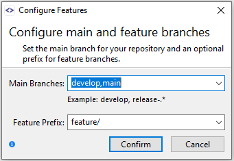

# Feature-Flow

Feature-Flow is a SmartGit development process available only in the [Standard Window](../GUI/Standard-Window.md) of SmartGit.

Feature-Flow aims to retain the simplicity of adding new features in process such as [Git-Flow Light](Git-Flow-Light.md), however Feature-Flow extends the versatility of the process to accommodate different branch and feature naming conventions that your team may use, and allows multiple trunk branches to be defined.

The main differences of Feature-Flow are:

- You need to tell SmartGit which trunk ('main') branches (e.g. `main`, `develop` or `master`) that you will usually be starting new features from.
- Feature-Flow will ensure that the local repository is up to date with the selected from trunk branch before continuing.
- If the trunk branch has conflicts that will prevent the local feature changes from being merged, Feature-Flow requires that any merge conflicts be resolved before finishing the feature, rather than waiting to resolve them after the new feature has been pushed to the remote and a new pull request opened.
- Local feature branch names are not reserved on the remote when starting features.

> [!NOTE]
> In this article we refer to 'trunk' branches as any long-lived branch in a repository, such as `main`, `master`, `develop` or release support branches.
> On the SmartGit UI, the term 'trunk' branch and 'main' branch are used interchangeably, but note that the concept extends to **any** trunk branch, and there is no requirement to use a branch with the name *main* when using the Feature-Flow process.

## Configuring Feature-Flow

From the **Branch \| Configure Features** menu option, you can inform SmartGit as to which main / trunk branches are allowed as a basis for new feature branches to be started from.
More than one trunk branch can be specified, e.g. `main` and `hotfix`.
RegEx patterns can also be specified as a branch pattern, e.g. If you need to support multiple production releases, specifying `release-.*` will recognize branches with names such as `release-1.1`, `release-2.3.4` as trunk branches from which hotfix branches can be created.

> [!NOTE]
> The trunk branch identified must exist at the time of setting configuration.
> When working with a fresh repository, you may need to set up your trunk branch(es) before starting new features.

In addition, you can specify the Feature Prefix to be used on new features.
This will default to `feature/`, which is the Git-Flow standard.
You can leave the Feature Prefix blank to remove any prefix from your feature branch names when you start new features.

> [!TIP]
> For users who use a combination of [**Feature-Flow**](Feature-Flow.md), [**Git-Flow**](Git-Flow.md) or [**Git-Flow-Light**](Git-Flow-Light.md), it is possible to provide a standard branch prefix for all processes in the [Git Config settings](../GUI/Preferences/Commands.md#tip---feature-branch-prefixing).

## Starting a New Feature

> [!NOTE]
> Your local repository must be up to date with the remote trunk branch from which you are branching the new feature.
> If the remote has diverged, you will need to use a command such as pull to obtain the most recent commits from your main trunk branch.

After opening a repository from the Standard Window, use the **Start** button on the top ribbon, or select **Branch \| Configure Features** menu option, and provide the name for the feature.
SmartGit will append the defined Feature Prefix to your feature branch name.
If you have not yet defined any trunk branches for this repository, SmartGit will also prompt you to identify the trunk branch(es) from which you will be creating features.

> [!NOTE]
> If you haven't yet configured trunk branch(es) and an optional feature branch prefix, the [Configure Features](#configuring-feature-flow) dialog will be shown.

Once the feature has been started, SmartGit will checkout a branch named *feature prefix + feature name*, and you can now make the changes needed to the working tree as needed to implement the feature.

## Integrate

Once work has been completed on the new feature in your Working Tree, use **Integrate** (on the top ribbon, or from **Branch \| Integrate [trunk]**) to prepare the feature to be merged into the remote branch named `[trunk]`.

Click the **Integrate** button on the **Local Files** perspective.

- If there are unstaged changes, SmartGit will show the **Local Files** subwindow and allow you to stage and commit your changes.
- SmartGit will fetch the remote trunk from which the feature was started.
- If the trunk branch (from which the local feature was created) has diverged since the feature was started, SmartGit will rebase your feature commits onto the remote trunk branch.

## Finish

Use **Finish** to complete the feature, which will push your local feature commits onto the remote trunk from which you started the feature<super>*</super>.
By default, if there are no interim commits by others to the remote branch, SmartGit will attempt to fast forward your feature commits onto the remote branch, however, there is the option to create a merge commit instead, and provide a commit message for the merge commit.

<super>*</super> If the remote is hosted on [GitHub or GitHub Enterprise](../Integrations/GitHub-integration.md), SmartGit's integration will assist with creating a pull request.

## Related How-Tos

- [How to resolve conflicts](../../HowTos/Workflows/How-to-resolve-conflicts.md): Learn how to handle merge conflicts that may occur when integrating your feature with an updated trunk branch
- [GitHub: keeping in sync with the upstream repository](../../HowTos/Workflows/GitHub-keeping-in-sync-with-the-upstream-repository.md): Keep your local trunk branches synchronized with upstream repositories
- [How to compare two branches/commits](../../HowTos/Workflows/How-to-compare-two-branches-commits.md): Compare your feature branch with the trunk branch to review changes before finishing
