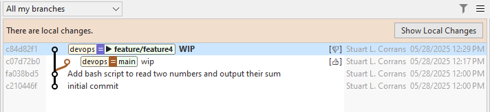

# AI Commit Annotations

SmartGit's AI Annotations are a powerful feature that allows custom extension of SmartGit's functionality.

Each AI Annotation instructs SmartGit to run a custom AI action, either interactively or in the background, 
using one or more selected (or inferred) _diffs_ in the commit history as input.

The output of the AI generated annotations can be displayed interactively in the UI or linked to the relevant commit(s) using [SmartGit's Notes](Notes.md) capabilities.

Some examples of what AI Commit Annotations can do:
- Describe the contents of a diff (e.g., the latest commit on a branch or the diff between 2 commits).
- Analyze a commit and provide feedback or descriptive metadata about quality factors introduced in the code.
- Instruct the LLM to generate icons to augment the visualization of Notes.
  
Because AI annotations can run in the background, SmartGit can automate checks while you work. The AI's responses are added to Git Notes, which can be viewed in the **Graph View** of the **Log and Standard Windows**.

## Getting Started

The AI Annotations feature leverages both SmartGit Notes and the common AI configurations used by all SmartGit AI features.
Before using AI Annotations, it's recommended to familiarize yourself with:

- [How to connect SmartGit to a LLM](../Integrations/AI.md#ai-llm-configuration-options)
- [SmartGit's Git Notes features](Notes.md)

To add a new AI Commit Annotation command in SmartGit, define a new [configuration](../Integrations/AI.md#ai-commit-annotation-configuration-options) section for each AI-Annotation you want to set up.

Configuration Options include:
- Standard LLM configuration settings.
- The `mode` in which the AI Annotation should run - either _interactively_, showing the output on the UI, or in the _background_, by appending the results to Git notes.
- The prompt to be executed by the AI when the annotation command is invoked, along with additional context such as the contents of the _diff_ and _commit message_.
- For background annotations:
  - The Notes refs where the annotation outputs should be stored.
  - Any additional Notes processing (title, options, visual representation in SmartGit's **Graph View**).

### Example - Analyzing the difference between two selected diffs and displaying the difference interactively

Adding the `[smartgit-ai-commit-annotations]` section below to your git config creates a new 'Describe Diff' command in the menu when exactly two commits are selected in the **Graph View** of the **Log Window** or the **Standard Window**.

This command uses an existing LLM configuration called `openai` (tested on `gpt-4.1` on Open AI).

```
[smartgit-ai-llm "openai"]
	type = openai
	model = gpt-4.1
	url = https://api.openai.com/v1
        apiKey = <ApiKey>

[smartgit-ai-commit-annotation "Describe Diff"]
	llm = openai
	maxDiffSize = 131072
	mode = interactive
	diff = pair
	title = Describe Diff
	prompt = Analyze the following Git diff between two commits and summarize the major changes between the commits.\n\
                Do not include the original diff or any reasoning in the response.\n\
                \n\
                ${gitDiff}
```

#### Note
> With `diff = pair`, if the selected diffs have both diverged from the common ancestor commit, SmartGit will prompt you to select the order of comparison of the diffs. You can swap the order if needed. A Git diff must be possible between the two commits, i.e., they must share a common ancestor.

### Example - Scanning commits for TODO comments and annotating the commit with a note and an icon

Adding the following `[smartgit-ai-commit-annotation]` section to your Git config will add a new 'Check Todos' command to the menu when a commit is selected in the **Graph View** of the **Log Window** or the **Standard Window**.

The same LLM configuration is used as in the previous example.

After saving the configuration, if you run the `Check Todos` AI annotation command, SmartGit will instruct the configured LLM to scan the selected commit for `todo` comments.
An appropriate thumbs up (`👍`) or thumbs down (`👎`) icon will be displayed (in place of the standard 'Note' icon), and a Git note will be added to the commit, showing the file location(s) of any TODO comments found.



```
[smartgit-ai-commit-annotation "Check For Todos"]
	llm = openai
	notesGraphMessageRegex = ^(.)
	maxDiffSize = 131072
	mode = background
	diff = perCommit
	title = Check Todos
	notesTitle = Todos
	notesRef = todocheck
	prompt = Analyze the following Git diff, and if any TODO comments are found,  \n\
                respond with the unicode character U+1F44E. \n\
                List the filename and line number of each TODO found. \n\
                If no TODO comments are found, respond with the unicode character U+1F44D,  \n\
                and the description "No todos found". \n\
                Do not include the original diff or any reasoning in the response.\n\
                \n\
                ${gitDiff}
```

#### Tips
> - Add a prefix such as `ai/` to the `notesRef` setting to distinguish AI-generated notes from 'standard' [Git Notes](Notes.md) clearly.
> - As with other SmartGit AI features, move any shared configuration (like `smartgit-ai-llm` definitions or reusable `smartgit-ai-commit-annotation` commands) to your global `~/.gitconfig` file for use across multiple repositories.
> - By default, SmartGit sets a small `maxDiffSize` to avoid sending large commits to LLMs, which may result in unexpected expenses. Adjust this value as needed.
> - Rerunning the same background AI Annotation on a commit will replace the previous note.
> - AI Notes can be removed just like standard GIT notes.
> - Avoid using the same notes `ref` for different annotation categories, and do not mix AI-generated Notes refs with manually created [Git Notes](Notes.md).
