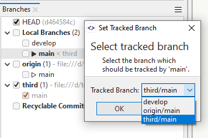

# Branches View

The **Branches** view shows *local* and *remote* branches, tags, and other *refs* from your repository and offers operations on these *refs*.
*Remotes* will also be displayed and used to group the *remote branches*.

The current branch is shown in bold text next to a solid filled triangle (`>`).
Any other tag or branch that points to the same commit as HEAD (the current branch) is shown with an unfilled triangle (`>`).
Branches below a remote displayed in a lighter color indicate branches that are tracked by local branches (i.e. are already locally available).

Behind a tracked branch you can find symbols to indicate the tracking state.

- '=' indicates that the tracking branch is equal to its tracked branch.
- '>' indicates "outgoing" commits.
- '<' indicates "incoming" commits.

## Additional Log Window Features
These features are only available in the **Branches View** of the [Log Window](Log-Window.md).

- The checkboxes in front of refs (e.g. branches or commits on local or remote repositories) are used to select which branches are shown in the Graph.
- The used color inside the checkbox is the color used in the Graph for the ref symbol.
- Clicking a checkbox of a category (e.g. "Features" or "\<remote\>") selects/unselects all refs of this category.
- If "Recyclable Commits" is selected, all commits in the local repository which are not reachable by refs are shown in the Graph.
  e.g., this can be useful to access a previous commit after amending a commit, or after a ref has been deleted.
  Note that unreachable commits are eventually garbage collected (permanently deleted) after the configured retention period (default 90 days).

## Upstream Tracked Branch
Git allows a branch to track an upstream branch on a remote.
The tracked branch will be used as the default reference point for any fetch, or push activity to/from the remote.
Additionally, the [Graph View](Graph-View.md#icons-used-in-the-graph-view) will display additional information, such as the current local branch's relative number of commits ahead/behind the tracked branch.

When a remote branch is checked out to a local repository branch, Git will automatically set the remote branch as the tracked upstream branch for the local branch.
However, the tracked upstream branch can be changed by right-clicking on the local branch in the **Branches View** and selecting **Set Tracked Branch**.

#### Note
> You may need to refresh the remote refs to get the latest status of the tracked branch, e.g. by using the _Fetch_ or _Pull_ commands.

## Tag-Grouping

The **Tags** part of the **Branches** view will be grouped according to a *tag-grouping configuration*.
This configuration is stored in your repository's `.git/config` and can be edited in **Repository \| Settings**, under the [**Tag-Grouping**](Repository/Repository-Settings.md#tag-grouping) section.
To disable this grouping feature for the current repository, set both **Pattern** fields empty.
