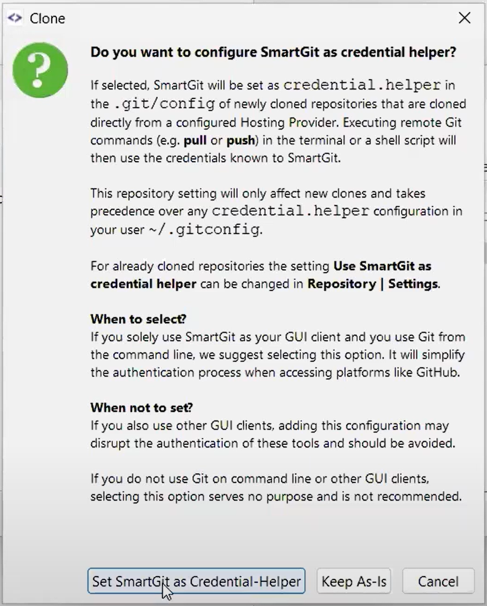
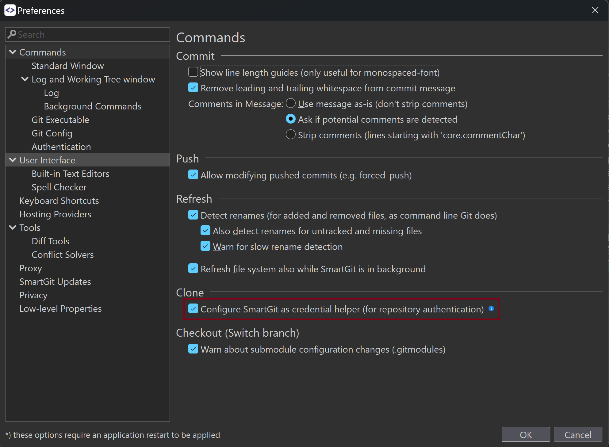

# SmartGit as Credential Helper

SmartGit can be used as a Git credential helper. This allows you to use the command-line Git client while letting SmartGit handle authentication.

## Enable the Credential Helper

The first time you clone a repository, SmartGit will display a dialog to enable SmartGit as a credential helper.



To change the setting, go to the [**Preferences**](Preferences/index.md) dialog under **Commands**, find the **Clone** section, and enable the **Configure SmartGit as credential helper (for repository authentication)** option.



## How it works

During cloning, the following entry is added to the `.git/config` of the freshly cloned repository.

```
[credential]
	helper = 
	helper = C:/Program\\ Files/SmartGit/bin/smartgitc.exe --credential
	useHttpPath = true
```

Whenever you invoke an action from the command line, SmartGit will be asked for credentials for the repository. When SmartGit is not running, it will be started in the background. When you have configured a [Master Password](Preferences/Commands.md#smartgit-credential-helper-https), you will be asked to enter it.
When you have multiple [Hosting Provider](../Integrations/index.md) profiles configured, SmartGit will ask you to select the right Hosting Provider once; after that, SmartGit will remember that setting.