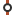
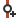
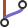
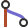
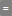
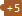

# Graph View

The **Graph** displays the log graph ("history") starting from the selected **Branches** anchors.
Branches, tags, and other *refs* will appear at the "appropriate" commits.
In the case of File (or Subtree) Logs or filtered Logs (see **Filter** input field below), each *ref* will be mapped to the most recent commit in the Graph that is still part of the ref's history.
For File (or Subtree) Logs, the content of the file (or subtree) at the mapped ref commit will be identical to the content of the actual commit to which the ref points.
For filtered Logs, when there is no relation between the mapped commit and the actual commit, you can still see which of your filtered commits are part of each ref's history.
Mapped refs that are not located exactly at the commit to which they are attached will be denoted by `~`.

## Variants of the Graph View

- The **Graph View** is the primary focus of the **Log Window** (Main Window).
  **Query \| Log** is a shortcut to the **Graph View** in the **Log Window**.
- The **Graph View** in the **Standard Window** is similar, but since there is no branch selector, you can only visualize the current branch or all branches when the 'My History' tab is open.
- The **Journal View** of the **Working Tree Window** shows only the commit history of the current HEAD commit.

## Display Options

The **Graph** can be customized in various ways using the **Options** hamburger icon above the **Graph View**.
Please note that not all options are available in every view.
- **Columns** - Adjust the columns shown in the Graph View.
  You can toggle the Commit SHA ID, the date the commit was created, and committer/author.
- **Avatar** - Displays either the author or committer, depending on the **Columns** selection.
  Options include avatar only, initials, full name, and name with email.
- **Show Auxiliary Branch** (**Working Tree Journal View** only) - Allows selection of one additional branch to view in the Journal graph.
- **Show More Commits** (**Working Tree Journal View** only) - Extends the number of commits shown at the bottom of the Journal graph.
  This is temporary; when the view is refreshed the commits shown will revert to the original number.
- **Show Common Commits** (**Working Tree Journal View** only) - Hides commits not common to both the Working Tree and the selected Auxiliary branch.
  Use this option only when an Auxiliary branch has been selected.
- **Show Branch Labels** (**Working Tree Journal View** only) - Toggles visibility of branch labels.
- **Show only Selected Branches and Tags** (**Log Window Graph View** only) - Hides branch labels not selected in the **Branches View**.

*Graph View in the Log Window, with the Recyclable Commits option enabled*

### Graph filter

Using the **Filter** field above the **Graph**, you can restrict displayed commits to those matching a specific filter criterion.
When the **Filter** field is modified, SmartGit will restart the search from the selected **Branches** and return matching commits incrementally.
The search is performed directly in the repository, so eventually, SmartGit will find all matching commits in the entire repository.

## Icons used in the Graph View

The icons in the **Graph View** represent the following:

-  - Position of the current Working Tree in the commit history.
  The icon color indicates the Working Tree status -- e.g., green if the Working Tree is clean (no changes since the last commit), red if there are changes or merge conflicts.
-  - Represents each commit shown in the Graph.
-  - Click to reveal collapsed commits, typically from a second parent in a merge commit.
-  - Indicates a new branch created from the node (i.e., the node is a parent of two or more separate commits).
-  - Indicates that two or more branches have been merged.
  The converging node is the merge commit.
-  - Indicates that the branch is equal to the tracked upstream branch on the remote (both branches are at the same commit).
-  - Indicates that the branch has commits ahead (+) or behind (-) the tracked upstream branch on the remote.
-  - Indicates the position of the tracked upstream branch when the current branch has commits ahead or behind.
  Icons for both the current and tracked branches appear as _Broken Puzzle Pieces_.
-  - Shows the position of the HEAD commit in the graph.
-  - Not sure what this one means.

The _Branch Label_ consists of:
- Remote name (if applicable)
- Branch name
- Ahead/behind indicators

> [!NOTE]
> - You can change the tracked upstream branch in the [Branches View](Branches-view.md#upstream-tracked-branch).
>   This affects how the commit ahead/behind _Puzzle Piece_ icons and indicators appear in the _Branch Label_.
> - Commit ahead/behind indicators may vary slightly across different **Graph View** variations.
