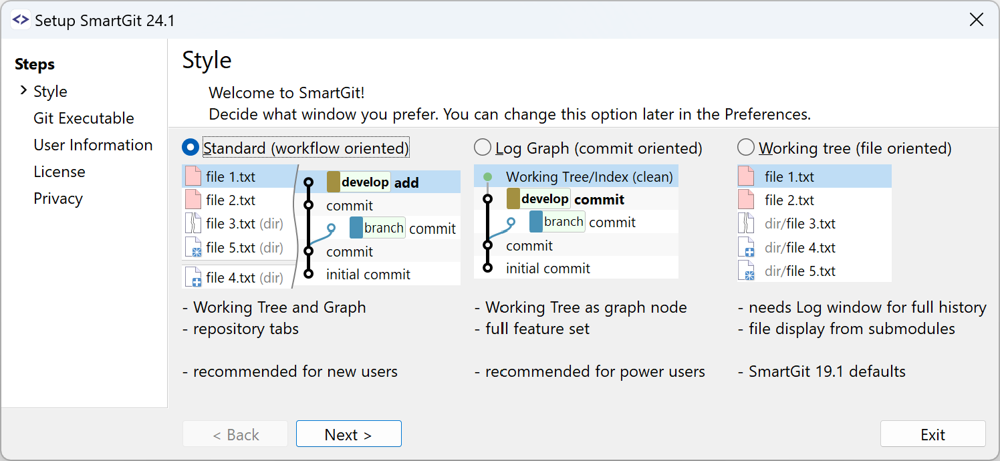

---
redirect_from:
  - /SmartGit/Manual/Main-Windows
  - /SmartGit/Manual/Main-Windows.html
---

# Main Windows

SmartGit provides three different Main Windows, all of which can execute Git commands, but each is tailored to a different type of git usage.

During installation, you will be prompted to choose from one of the 3 below options as your default Main Window, however, you always have the option to change your selection in the **Startup Window** setting in the [User Interface Preferences](Preferences/User-Interface.md), under the **Edit \| Preferences** menu item.

- The [Standard Window](Standard-Window.md) simplifies workflows by combining a file-centric **Local Files** view with a graph-based **History** view of the repository. The Standard Window also provides access to the [Feature-Flow development process](../DevelopmentProcesses/Feature-Flow.md).
- The [Log Window](Log-Window.md) emphasizes the commit graph history, displaying local changes as a separate node attached to the HEAD. The Log Window is ideal for power users who wish to have complete control over their repository's commit history, using features such as Rebase, Squashing commits together, and re-writing commits.
- The [Working Tree Window](Working-Tree-Window.md) focuses on a file-centric display of changes; it also shows the [**Journal**](Journal-View.md), a log of the latest commits in the current branch, and a baseline/comparative branch (e.g., for cherry-picking).

#### Tip
> The theme used throughout SmartGit can be customized under the **User Interface** settings in the **Edit \| Preferences** menu, where you can select between themes such as Light, Dark or Custom [theme selections](Preferences/User-Interface.md#theme-selection).

## Default SmartGit Startup Behaviour

Each time SmartGit is launched, SmartGit will open the Window style that you have configured as your preferred Window. You can specify your preferred window style in two ways:

1. During the *Setup wizard*:

2. After setup, through the *Preferences* (Edit \| Preferences).

### Using Multiple Windows

You can use all three main windows simultaneously, but you can configure only one default in the Preferences. For example, the default window is used when you open a repository using the command line.

To open another Window style (in addition to the current Window you have open), use the **Window** Menu, and choose **Standard**, **Working Tree** or **Log Window**, depending on which Window is currently in Context. You can open a second Window of the same type by selecting **New Window**. Context, such as the current repository, will be transferred to the new Window.

### Rearrange View Layouts (Perspectives) within Windows

You can rearrange the views by dragging their titles in the Working Tree and Log windows. To place multiple views into one tab group, drag a view onto the center of another view. To restore the default layout, use **Window \| Reset Perspective**. Each of these windows can remember two different layouts (called perspectives). You can switch between them using **Window \| Main Perspective** and **Window \| Review Perspective**.

For further information on each of the Main Windows in SmartGit, please refer to:

- [Working Tree Window](Working-Tree-Window.md)
- [Log Window](Log-Window.md)
- [Standard Window](Standard-Window.md)
- [Using the SmartGit Application](GUI.md)
