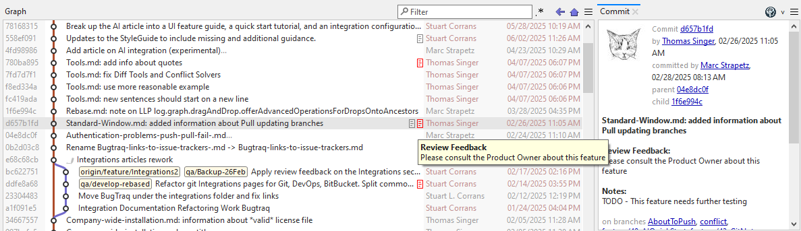

# Working with Git Notes
SmartGit supports the [Git notes](../GitConcepts/GitNotes.md) feature available in Git, which allows additional information such as metadata to be associated with a commit.

Notes can be used for many different purposes, such as:
- Storing reference information to requirements (as an alternative to using [BugTraq](../Integrations/Bugtraq-links-to-issue-trackers.md) to link to a ticketing in a commit message)
- Linking peer or AI code review comments to a commit without depending on additional review features or external persistence in a Git hosting service
  ([git-appraise](https://github.com/google/git-appraise) is an example).

Although Git's notes feature permits only one note per commit per category, additional categories can be configured if necessary, allowing multiple notes to be associated with the same commit.
Please consult the [Git Notes configuration guide](../Integrations/GitNotes-Integration.md#smartgit-notes-section-reference) for further details.

SmartGit's notes support includes the following features:
- The ability to add and remove notes through the UI.
- The ability to add new categories of notes [through configuration](../Integrations/GitNotes-Integration.md#a-minimal-smartgit-notes-configuration).
- If you wish to synchronize notes with a remote:
   - The ability to manually synchronize notes with a remote using the **Other Refs** section of the **Branches View**.
   - The ability to [configure Git to always push and fetch note refs](../Integrations/GitNotes-Integration.md#configuring-automatic-note-synchronization-with-remotes) from the repository.

## Enabling Notes for a Repository

To use the SmartGit notes feature, you need to enable it with one of the below methods:
- Add one or more `[smartgit-notes "<category-id>"]` sections in the Git configuration file hierarchy (e.g. to the repository `.git/config` file), e.g.:
  ```
  [smartgit-notes "QA"]
      ref = refs/notes/qa
  ```
- Or, if SmartGit detects an entry under the default `refs/notes/commits` path of the repository refs, it will automatically enable notes features for the repository.

Please consult the [Git Notes configuration guide](../Integrations/GitNotes-Integration.md#enabling-notes-features-in-smartgit-on-a-repository) on how to set up SmartGit notes categories.

#### Note
> - Git notes are not automatically pushed or fetched from the remote by default.
>   However, it is possible to [configure your local repository]() to automatically synchronize note refs any time push and fetch activity is performed.
> - Not all Git hosting services will show notes on their web portal UI. 
>   However, all major hosting services will retain the notes refs where they can be synchronized with other repositories.
> - SmartGit refers to the default `commits` notes category ref as `Notes` on the UI

## Using Notes in SmartGit
Once enabled, notes will appear via an icon in the color configured for the notes category, in the **Graph View** of the **Log Window** and the **Standard Window**.



The following UI options are available:

- **Add** a new Note by selecting the target commit in the Graph View, and right clicking the **Add Note...** command.
  SmartGit will prompt you for the note contents, and the category of note can be selected from one of the configured categories.
  
- **Hover** the mouse over the note icon to see the contents of the note.

- A note can be **Removed** by right clicking on the note and selecting `Remove <category> note`.

  If there is more than one category of note on the same commit, be sure to select the correct note category!

- If the commit already contains a note of the same category, when you **Add** a note of the same category, 
   SmartGit will prompt you to either **Append** additional note content to the existing note, or, 
   you can choose to replace the existing note with the new content by choosing **Overwrite**.

- When a commit is selected, the [**Commit View**](Commit-View.md) will also show all _Note_ data beneath the commit message.

## Troubleshooting

- The **Add Note** command does not appear when I click on a commit in the **Graph View**?

> This is because the notes feature has not been [enabled in SmartGit](#enabling-notes-for-a-repository).

- Why do I receive the warning _Do you want to replace the existing note?_ when I attempt to add a note to a commit?

> By design, Git notes only allows a single note per commit, per category to be added.
>
> However, SmartGit has the ability to merge new Note content with existing and replace the previous note of the same category on this commit.
  
- I've pushed a branch containing notes in my repository to a remote, however when others clone the repository, they do not see the notes?

> Git notes are not stored on the current branch, and must be pushed and fetched separately.
  In the **Log Window**, under the **Branches View**, open the *Other Refs* section and push the `notes/<category>` ref to the remote.
  Similarly, other users need to fetch *Other Refs* in order to obtain all notes for the repository

- I've rebased several commits containing notes using the squash option, and now I don't see my notes!

> As notes are linked to a specific commit id, rewriting commands such as rebase will create new commits.
  You can use the [notes rewriteRef configuration](../Integrations/GitNotes-Integration.md#copying-git-notes-during-rewriting-activity-eg-rebase) to instruct git to copy (or append) notes on squashed commits across to the newly rewritten commit.
  
