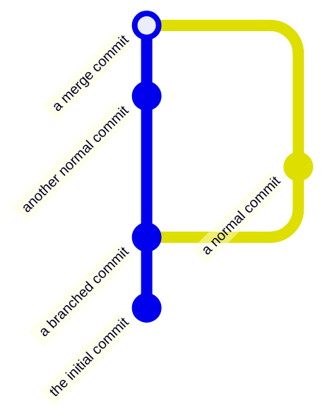
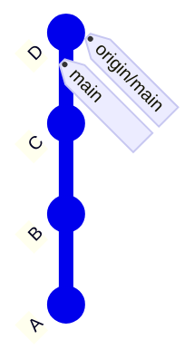
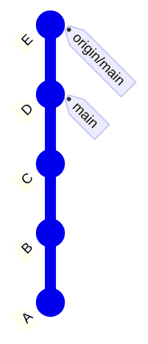

# Commits

A *commit* is a set of file changes stored in a repository along with a commit message.
The **[Commit command](../GUI/Local-Operations-on-the-Working-Tree.md#commit)** is used to store working tree changes (which have been staged) in the local repository, thereby creating a new commit.

## Commit Graph

Repositories generally<sup>1</sup> start with an initial root commit, and each subsequent commit will be directly based on one or more parent commits.
This creates a 'commit graph' (technically a Directed Acyclic Graph (DAG) consisting of of commit nodes), with each commit being a direct or indirect descendant of the initial commit.
Hence, a commit is not just a set of changes; due to its fixed location in the commit graph, it also represents a unique repository state.

> [!NOTE]
> <sup>1</sup> It is possible for a Git repository to contain more than one root commit (`git checkout --orphan`) and therefore contain multiple unrelated commit graphs.
> The wisdom of having more than one root commit needs to be balanced against creating separate repositories for each project.

Therefore:

- The initial commit has no parent commits.
- Normal commits have exactly one parent commit.
- *Merge commits* have two or more parent commits.



Each commit is identified by its unique *SHA*-ID, and Git allows *checking out* every commit using its SHA.
However, with SmartGit you can visually select the commits to check out instead of entering unwieldy SHAs manually.
Checking out sets the HEAD and working tree to the commit.
After modifying the working tree, committing your changes will create a new commit whose parent is the one that was checked out.
Newly created commits will also be *heads* in the DAG, because no other commits descend from them.

## Putting It All Together

The following example shows how commits, branches, pushing, fetching, and (basic) merging interact.

Let's assume we have commits `A`, `B`, and `C`.
Both **`main`** and **`origin/main`** point to `C`, and **`HEAD`** points to **`main`**.
In other words, the working tree has been switched to the branch **main**.
This looks as follows:

```mermaid {filename="commit-graph-initial-refs.svg" branchpointers="true"}
%%{init: { 'gitGraph': {'showBranches': false, 'showCommitLabel': true, 'useMaxWidth': false}} }%%
gitGraph BT:
   commit id: "A"
   commit id: "B"
   commit id: "C" tag: "main" tag: "origin/main"
```

Committing a set of changes results in commit `D`, which is a child of `C`.
**`main`** now points to `D`, meaning it is one commit ahead of the tracked branch **`origin/main`**:

```mermaid {filename="commit-graph-after-commit.svg" branchpointers="true"}
%%{init: { 'gitGraph': {'showBranches': false, 'showCommitLabel': true, 'useMaxWidth': false}} }%%
gitGraph BT:
   commit id: "A"
   commit id: "B"
   commit id: "C" tag: "origin/main"
   commit id: "D" tag: "main"
```

As a result of a Push, Git sends commit `D` to the origin repository, moving **`main`** to the new commit `D`.
Because a remote branch always refers to a branch in the remote repository, **`origin/main`** of our repository will also be set to commit `D`:



Let's assume someone else has modified the remote repository and committed `E`, a child of `D`.
This means the **`main`** in the origin repository now points to `E`.
When fetching from the origin repository, we will receive commit `E`, and our repository's **`origin/main`** will be moved to `E`:



Finally, we will now merge our local **`main`** with its tracking branch **`origin/main`**.
Because there are no new local commits, this will simply move **`main`** *fast-forward* to the commit `E` (see [Fast-forward Merge](Merging.md#fast-forward-merge)).

```mermaid {filename="commit-graph-after-fast-forward.svg" branchpointers="true"}
%%{init: { 'gitGraph': {'showBranches': false, 'showCommitLabel': true, 'useMaxWidth': false}} }%%
gitGraph BT:
   commit id: "A"
   commit id: "B"
   commit id: "C"
   commit id: "D"
   commit id: "E" tag: "main" tag: "origin/main"
```
