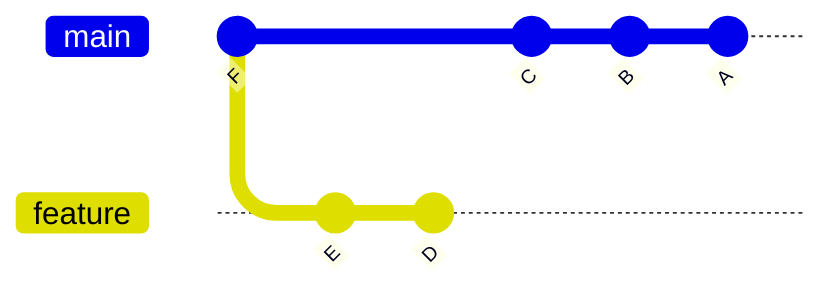
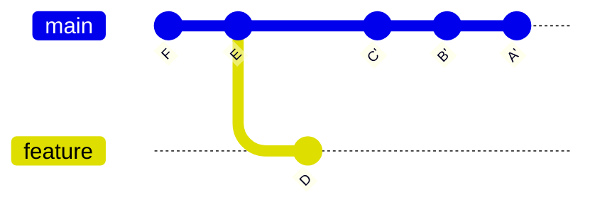

# Rebasing

The Git `rebase` command allows you to apply commits from a source branch to another target branch *WITHOUT* creating a merge commit, resulting in a linear commit history on the target branch.
Rebase can be viewed as more powerful version of [Cherry-Pick](Cherry-Picking.md), optimized to apply multiple commits from one branch to another.

Since rebasing can be difficult to visualize, it is recommended that you use SmartGit when rebasing, where rebase operations can be performed in the UI, e.g., by simply selecting commits and dragging them to the required parent.
See [Rebasing in SmartGit](../GUI/Branch/Rebase.md).

Depending on the state of the source and target branches, rebase may result in:

- **Fast Forward** of new commits -- if there are no new commits on the target branch which are not present in the source branch, the target branch can simply be updated to 'point' at HEAD of the source branch without creating new commits.
- **Rewritten Commits** -- if there are new commits in both source and target branches, Git will need to rewrite commits in the target branch (assigning new SHA hashes).

In addition, `rebase` allows for advanced history rewriting and cleanup operations, such as squashing, deleting and modification of existing commits.

When rebase is used with the `onto` parameter, additional precision can be specified as to controlling which commits are to be rewritten, as well as to change the parent commit from which a branch is created.

After a successful rebase, the HEAD of the current branch will point to the rewritten fork containing the changes.

> [!EXAMPLE]
> In the below common scenario, after forking at commit `C`, branches `main` and `feature` are now both 2 commits ahead of `C`, and the commits in `feature` cannot be fast-forwarded onto `main` because of commits `A` and `B`.
>
> As we prefer a linear commit history, we wish to rebase the commits `E` and `F` (on the `feature` branch) onto the `main` branch, as follows:
>
> ```
> git checkout feature
> git rebase main
> ```
>
> **Before Rebase:**
> ```mermaid {filename="rebase-before.svg"}
> %%{init: { 'gitGraph': {'showBranches': true, 'showCommitLabel': true, 'useMaxWidth': false}} }%%
> gitGraph
>    commit id: "..."
>    commit id: "C"
>    branch feature
>    checkout main
>    commit id: "B"
>    commit id: "A" tag: "branch1" tag: "branch2"
>    checkout feature
>    commit id: "E"
>    commit id: "D"
> ```
>
> **After Rebase:**
> ```mermaid {filename="rebase-after.svg"}
> gitGraph
>    commit id: "..."
>    commit id: "C"
>    commit id: "B"
>    commit id: "A"
>    branch feature
>    commit id: "E'"
>    commit id: "D'"
> ```

> [!NOTE]
> - Commits `D` and `E` are rewritten (to `E'` and `F'`) such that the parent of `E'` is now `A` (i.e. to reference the HEAD of `main`).
>   In this rebase scenario, Git will automatically determine the common parent commit between the branches (i.e. `C`) and calculate that commits `E` and `D` need to be rewritten (since `C` is already present in `main`).
> - Branch `main` (including commits `A`, `B` and `C`) is not modified by the rebase.
> - After the above rebase, it is now possible to [Fast Forward](Merging.md#fast-forward-merge) `main` up to commit `D'`.
> - As can be seen, the effect is to create a linear commit history.

## Rebase Onto
Rebase with the `--onto` switch allows for more advanced scenarios.
In the below example, since forking at commit `F`, `main` has 3 commits (`A`, `B` and `C`) ahead, and `feature` has 2 commits (`D` and `E`) ahead.
We now wish to include commit `E` (currently on branch `feature`) into the `main` branch (but not to include commit `D`).
Additionally, we would like to specify that commit `E` is to be included before commits `A`, `B`, `C`.

```
git checkout main
git rebase --onto E F
```

**Before Rebase:**


**After Rebase:**


> [!NOTE]
> - The commit history of `main` will be rewritten -- although the commits `A'`, `B'` and `C'` have the same changes as the original commits `A`, `B` and `C` respectively, a new SHA hash will be assigned for each commit rewritten after the rebase is completed.
> - The commit history of `feature` is unchanged in this scenario -- commits `D`, `E` and `F` aren't modified by the above rebase.

## Interactive Rebase

Rebase with the `--interactive` switch allows a specified range of commits to be rewritten, and then, interactively, you will then need to specify how each commit in the range will be handled, with options such as:
- **pick** -- i.e., to include the commit.
- **reword** -- i.e., to include the commit but to change the commit message.
- **edit** -- i.e., to amend the contents of the commit.
- **squash** -- i.e., to combine the contents of the commit into the previous commit, i.e., reducing the number of commits.
  Squash can be applied successively, so that any number of commits are combined into one commit.
- **drop** -- i.e., remove the commit.

Additionally, the order of the commits can be changed during an interactive rebase.

See also: [Interactive Rebasing in SmartGit](../GUI/Branch/Rebase-Interactive.md).
