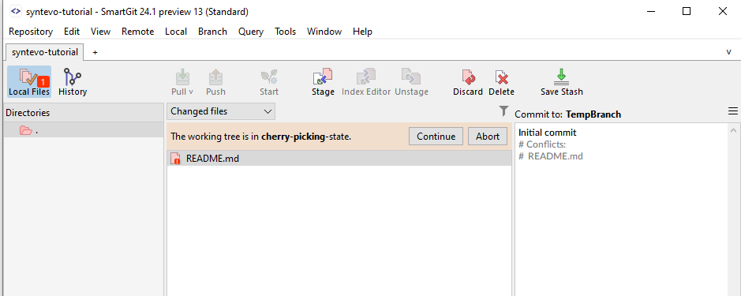

# Working Tree States

The Working Tree is the folder structure into which files in your repository will be placed after a check out.

In general, the Git Working Tree will be in a normal state, allowing you to issue standard Git commands to check out branches, stage changes to the index, or create new commits.

However, there are situations where commits cannot be completed, such as when a merge or rebase fails due to a conflict, or during an interactive rebase.

This leaves Git in an intermediate state, requiring manual intervention (e.g., resolving merge conflicts or providing information/performing actions during an interactive rebase).

SmartGit will provide a visual alert as per below when the Working Tree is in one of these special states, and will provide options on how to proceed in order to get the Working Tree back to a normal status.

## Merge Conflicts (Merging status)

When a [Merge](Merging.md) or [Rebase](Rebasing.md) fails due to conflicts in files that Git cannot automatically resolve, Git adds merge conflict markers to the affected files and leaves the Working Tree in a Merging state.

In this case, you can complete the merge in two ways:

- Resolve the conflict using a tool like the [SmartGit Conflict Resolver](../GUI/Branch/Conflict-Solver.md), stage the file changes, and commit at the Working Tree root.
- Revert the entire Working Tree to its state before the merge (`git merge --abort`) or before the rebase (`git rebase --abort`).

SmartGit automatically detects when the Working Tree is in Merging state and guides you through the conflict resolution process.

## Interactive Rebasing (Rebase status)

During an [Interactive Rebase](Rebasing.md), Git requires additional user input to complete the rebase. For example:

- Selecting which operation to perform on each commit (e.g., Pick, Squash, Fix, Drop, etc.).
- Pausing the rebase operation if you Edit one or more commits or want to edit one or more commit messages.

After amending a commit during an 'Edit' operation in a rebase, you must prompt Git to continue with the rebase.

SmartGit automatically detects when the Working Tree is in a Rebase state and guides you through the interactive Rebase process.

## Cherry Picking status

As with Merge and Rebase, if a [Cherry-Pick](Cherry-Picking.md) fails due to a reason such as a merge conflict, Git will leave the Working Tree in a 'Cherry-Picking' status. Again, you have the option to

- Resolve the conflict and continue
- Abort the cherry-pick

## Reverting status

Again, as with Merge and Rebase, if a [Revert](Reverting.md) operation fails due to a reason such as a merge conflict, Git will leave the Working Tree in a 'Reverting' status.

As above, you have the option to:

- Resolve the conflict and continue
- Abort the Revert

## Bisecting status

Git [Bisect](../GUI/Bisect.md) is an interact command which requires you to iterately test whether the currently checked out commit contains an undesirable change, and then to `bisect`  this 'bad' commit and an earlier commit ('good') known to not to have contained the issue, by choosing a commit mid-way between these commits. While the unwanted commit is being identified, your Working Tree will be in a 'Bisecting' status, until you either:

- Locate the bad commit and leave the bisect operation
- Abort the bisect operation

## Named Branch vs. Detached HEAD

Although not technically a git `status`, generally, your Working Tree directory represents a checked-out branch, and any further commits from the Working Tree will be appended to the branch, moving the branch HEAD forward to point to the new commit.

However, you can also check out the Working Tree to point to a specific commit. The Working Tree will be in a **Detached HEAD** state in this case. For more information on recovering from a Detached HEAD state, refer to the documentation on [Branching](Branches.md#branches-are-just-pointers-to-commits). 
