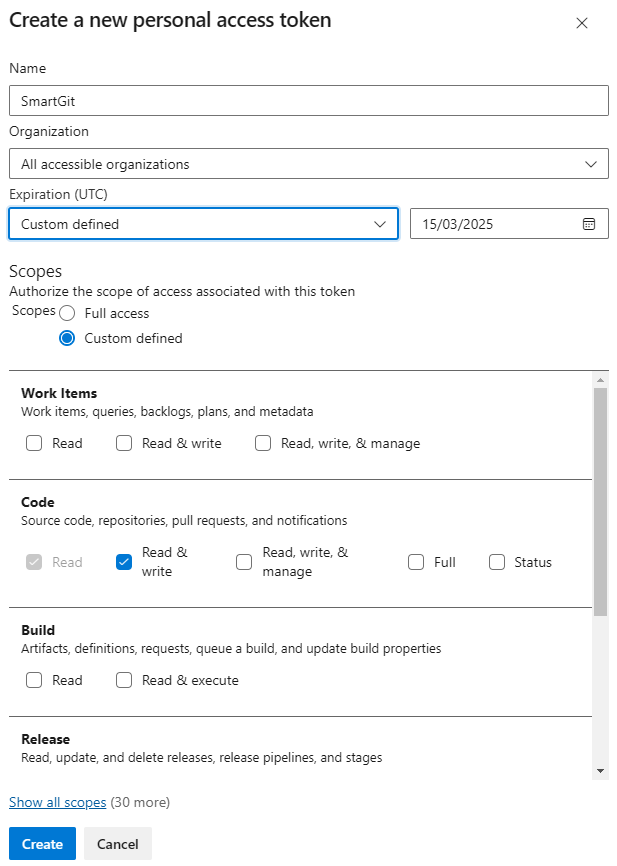

# Azure DevOps

SmartGit provides integration with [Azure DevOps](https://learn.microsoft.com/en-us/azure/devops), including:

- Azure DevOps Services (Cloud)
- Azure DevOps Server (On Premises)

Once integration is configured, the following integrated functionality is available from within SmartGit:

- [Integrated Cloning](Integrated-Cloning.md)
- [Integrated Pull Requests](Integrated-PullRequests.md)
- [Integrated Commenting](Integrated-PullRequest-Comments.md)

## Setup

Azure DevOps integration is set up under **Preferences**, section **Hosting Providers**.
Under the **Add** button, select **Azure DevOps**.
This opens the **Add Hosting Provider** dialog and prompts for an access token.

Use a [Personal Access Token (PAT)](#setup-via-personal-access-token) to connect SmartGit to Azure DevOps.
For Azure DevOps Services (Cloud), SmartGit accepts a PAT pasted directly into the **Token** field.
Leave the **Organization** field empty for a PAT with access to all accessible organizations.
For an organization-scoped PAT, enter the organization's name in **Organization**.
The name must match the PAT's organization access scope.

> [!WARNING]
> Azure DevOps OAuth is deprecated by Microsoft.
> New Azure DevOps OAuth app registrations are no longer accepted since April 2025.
> Existing Azure DevOps OAuth apps stop working on 2026-07-24.
> For SmartGit, use a Personal Access Token instead of OAuth.

### Setup via Personal Access Token

You can connect SmartGit to Azure DevOps by providing a Personal Access Token (PAT).
Microsoft describes a PAT as an alternative password for Azure DevOps.
You can create PATs in the Azure DevOps portal from **User Settings** -> **Personal access tokens**.
To get there, you first need to open one of your Azure DevOps organizations.
To create a PAT that works with SmartGit:

- Open [https://aex.dev.azure.com/me](https://aex.dev.azure.com/me) to see the organizations available for your account.
- Navigate to any of your organizations.
- Click **User Settings** in the top-right corner and select **Personal access tokens**.
- Create a new token and configure the required organization access:
  - Under **Organization**, choose **All accessible organizations** or a specific organization.
  - Under **Scopes**, only **Code** -> **Read & write** is required.
  - Choose an expiration date that is allowed by your Azure DevOps policy.
- Copy the generated token and paste it into SmartGit.



The screenshot shows **All accessible organizations**, but this setting is optional.
If you select a specific organization, enter the same organization in SmartGit's **Organization** field.

For additional details, see Microsoft's [Personal Access Token documentation](https://learn.microsoft.com/en-us/azure/devops/organizations/accounts/use-personal-access-tokens-to-authenticate).

### Setup with multiple accounts

If you have multiple Azure DevOps accounts, you can run through the above procedure for each of your accounts.
This requires you to sign in for each account in your web browser before creating the PAT.

To have Git work reliably with multiple Azure DevOps accounts, Git has to request credentials per repository.

To check whether the proper configuration is already set, invoke:

```sh
git pull
```

If Git requests credentials only for `dev.azure.com`, configure:

```sh
git config --global credential.dev.azure.com.useHttpPath true
```

Then run `git pull` again to confirm that Git will now ask for the complete repository URL.

### Setting up a Custom Azure DevOps Application for SmartGit

This OAuth-based setup is legacy and should no longer be used for new SmartGit setups.
Microsoft has deprecated Azure DevOps OAuth, new Azure DevOps OAuth app registrations are no longer accepted, and existing Azure DevOps OAuth apps stop working on 2026-07-24.

Microsoft recommends [Microsoft Entra OAuth](https://learn.microsoft.com/en-us/azure/devops/integrate/get-started/authentication/entra-oauth?view=azure-devops) as the long-term replacement for Azure DevOps OAuth.
However, Microsoft also documents that Entra apps do not yet natively support Microsoft account (MSA) users for the Azure DevOps resource.
Because of this, Microsoft Entra OAuth is currently not a drop-in replacement for all SmartGit users.

Use a [Personal Access Token](#setup-via-personal-access-token) for SmartGit instead.

### Authentication hints

If Azure DevOps authentication fails in SmartGit, create a new PAT and verify the following points:

- For an organization-scoped PAT, the SmartGit **Organization** field matches the PAT's organization access scope.
- Leave the SmartGit **Organization** field empty for a PAT with **All accessible organizations**.
- The PAT has **Code** -> **Read & write** scope.
- You created the PAT while signed in to the correct Azure DevOps account.

Azure DevOps OAuth app secrets expire after 60 days and must be rotated regularly.
This is another reason why OAuth is no longer recommended for SmartGit.

For background, see Microsoft's documentation on [Azure DevOps OAuth deprecation](https://learn.microsoft.com/en-us/azure/devops/integrate/get-started/authentication/oauth?view=azure-devops), [managing Azure DevOps OAuth application secrets](https://learn.microsoft.com/en-us/azure/devops/integrate/get-started/authentication/azure-devops-oauth?view=azure-devops#managing-app-secrets), and [Microsoft Entra OAuth](https://learn.microsoft.com/en-us/azure/devops/integrate/get-started/authentication/entra-oauth?view=azure-devops).

### Repository access using "Generate Git Credentials"

If you are only interested in accessing your Azure DevOps Git repositories, but you do not need the additional *Azure DevOps Hosting Provider functionality* in SmartGit, open the Azure DevOps website, navigate to your repository, invoke **Clone**, and then **Generate Git Credentials**.
When SmartGit asks you for **User Name** and **Password**, enter these credentials.
