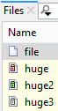

# Git-LFS support in SmartGit

SmartGit provides support for common Git Large File Storage (Git-LFS) operations, allowing you to use LFS functionality such as LFS file tracking and locking, from the comfort of the SmartGit GUI.

Please refer to [Git LFS concepts](../GitConcepts/GitLargeFileStorage.md) for background information and benefits of using Git-LFS on selected files in your repository.

> [!TIP]
> The Git LFS extension must be installed on your local computer, and LFS filters must be enabled for any repository where LFS file storage will be used.
>
> It is recommended that you use the version of the Git executable [bundled with SmartGit](../GUI/Preferences/Commands.md#git-executable) and use SmartGit to enable and configure LFS in your repositories for best compatability.

## Enabling Git-LFS on a Git Repository with SmartGit

After selecting the desired repository from the **Repository View**, go to **Local \| LFS \| Install** to enable LFS support for your repository.

SmartGit will prompt for confirmation.
Select **OK** to confirm LFS support for the repository.

(This runs the equivalent `git lfs install` command in the repository.)

## Tracking a new file in LFS

After adding a new file under the Working Tree of your local repository, select the untracked file in the **Files View** and use the **LFS \| Track** command to track this file in LFS.

SmartGit will display a **LFS Track** dialog, prompting you to provide a tracking pattern:
- SmartGit will provide options to track only the selected file (e.g. `MyFile.png`), or to track any file with the same extension (`*.png`).
- You can edit the pattern to customize which files are tracked in LFS, e.g., `File-*.png`.
  (This is equivalent to running `git lfs track MyFile*.png` from the Git command line.)

SmartGit will add the pattern into the `.gitattributes` file, which identifies files tracked by LFS.

> [!NOTE]
> Remember to add and commit the `.gitattributes` file into your Git repository!

## Locking LFS Files for Exclusive Editing
To prevent other users from concurrently editing a file tracked by LFS in your Git repository, you can **[lock](../GitConcepts/GitLargeFileStorage.md#git-lfs-file-locking)** the file on the LFS server to obtain exclusive modification access.

> [!NOTE]
> The ability to perform LFS locking is disabled by default in SmartGit.
> To use LFS locking, toggle the **[Low-Level Property](../GUI/AdvancedSettings/Low-Level-Properties.md)** `status.lfs.locks` to `true` to enable the **Lock** command in SmartGit.
>
> LFS file locking is only relevant after a repository and associated LFS files have been pushed to a remote server.
> If no LFS server remote is detected, Git LFS will issue an error similar to `failed: missing protocol`.

Once enabled, LFS locking is available via the **LFS \| Lock** command from the **Files View** in all SmartGit Views:
- The **Files View** of the **Working Tree Window**
- The **Local Files** perspective of the **Standard Window**
- The **Files View** of the **Log Window** (provided that the Working Tree node of the commit graph is selected)

Similarly, the **LFS \| Unlock** command will unlock the file on the LFS server, allowing others to modify it.

## Displaying locks

To view Git-LFS lock states in the **Files** views (both Log and Working Tree Windows), *Git-LFS locks verification* must be enabled for your repositories.

`git config 'lfs.https://github.com/<my_repo>.git/info/lfs.locksverify' true`

#### Technical Note on LFS Locks Verification

The lock verification configuration is stored in `git.config` with the section `[lfs \"https://server/repo.git/info/lfs\"]`:

```
[lfs \"https://github.com/myrepo.git/info/lfs\"]
    ...
    locksVerify = true
```

When lock verification is enabled, SmartGit will invoke the following additional commands in the background:

- `git lfs locks --local`
- `git lfs locks --remote`

These commands run after every **Pull**, **Fetch**, and after every **background Fetch** (if enabled under Preferences -> Background Commands).

The output of these `git lfs locks` commands is written to:

- `./git/smartgit/lfs-locks-local`
- `./git/smartgit/lfs-locks-remote`

Once these files are present, additional information is shown when viewing files in the **Files View**:
- The icon under the **Name** column will indicate the lock state of LFS files.
- In the **Standard Window**, when viewing **Local Files**, the LFS status will be shown on the right of the file name.

> [!EXAMPLE]
> The following screenshot shows how this display appears:
>
> - `file` - a normal file to which no LFS lock information applies
> - `huge` - locked by someone else
> - `huge2` - locked by you
> - `huge3` - lockable (configured in `.gitattributes`)
>
> 

> [!NOTE]
> In the **Log** window, lock states are only displayed for the **Working Tree node**.

## Troubleshooting
- To enable the **LFS \| Lock** command, set the property `status.lfs.locks` under Preferences -> Low-Level Properties.

- If your git-lfs executable is not detected by SmartGit, try using absolute paths for the `Git-LFS` executable in your gitconfig file (where the Git-LFS filter is defined).
  Alternatively, configure SmartGit to use the bundled Git under the [Command Preferences](../GUI/Preferences/Commands.md#git-executable) options.

- If you experience unexpected errors when using the **Lock** or **Unlock** commands, this may be due to a known behavior in Git-LFS v2.5.
  It may fail if the working directory path has incorrect case sensitivity.
  To work around this issue, ensure that the path in `repositories.xml` has the correct case.
  The drive letter must be uppercase.
  Example:

  ``` xml
  <obj type="@Repository" id="...">
      <prop key="name" type="String" value="smartgit"/>
      <prop key="favorite" type="boolean" value="true"/>
      <prop key="git" type="boolean" value="true"/>
      <prop key="path" type="String" value="D:\\smartgit"/>
      <prop key="expanded" type="boolean" value="false"/>
  </obj>
  ```
