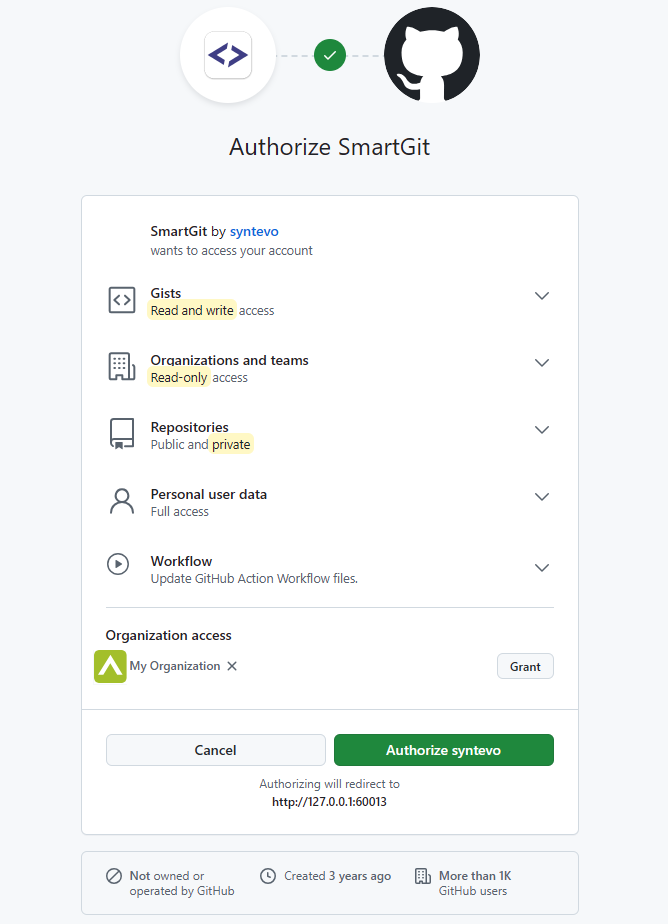
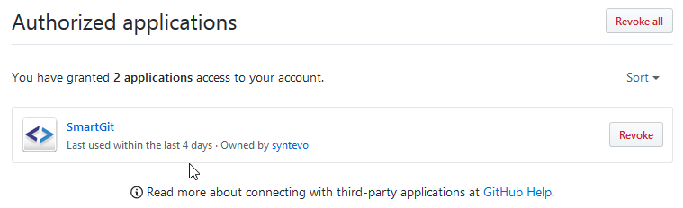

# GitHub Integration

Once integration with GitHub has been [set up](#Setup), SmartGit provides the following additional integrated functionality:

- [Integrated Cloning](Integrated-Cloning.md)
- [Integrated Pull Requests](Integrated-PullRequests.md)
- [Integrated Commenting](Integrated-Comments.md)

In addition to integrating with GitHub's repository features, it is possible to set up [Bugtraq](Bugtraq-links-to-issue-trackers.md) integration.

## Setup

To set up GitHub integration in SmartGit, go to **Edit \| Preferences**, navigate to the **Hosting Providers** section, and click the **Add** button.
In the list of available providers, select **GitHub** to bring up a dialog allowing configuration of the GitHub account.
SmartGit then prompts for an access token.

There are two ways to generate this access token:
- Allow SmartGit to [autogenerate and manage an OAuth token](#autogeneration-of-oauth-token) (Recommended).
- Manually generate a [Personal Access Token (PAT)](#creating-a-github-personal-access-token) in GitHub.

### Autogeneration of OAuth Token

The recommended method of access is via an autogenerated OAuth token.
Leave the Token field blank, and instead click on the **Generate Token** button.
This will open your default web browser, where you will need to confirm to GitHub that you authorize SmartGit for access to GitHub.

#### Note
> Be sure to also **Grant Access** to each required organization; otherwise, the corresponding organization repositories won't show up and can't be accessed in SmartGit.
> You may need to complete multi-factor authentication formalities on GitHub if this has been configured on your GitHub account.



Once you have confirmed this page, you will be redirected to a SmartGit page confirming that access has been successfully granted.
(The page is on `127.0.0.1`, where SmartGit is waiting to intercept the one-time authorization code generated by GitHub) 
This code will be used to create an *application access token*, which will automatically populate the **Token** field.

Finally, confirm the **Add Hosting Provider** dialog by clicking using **Add**.

#### Note

> If this redirection does not work, it may be caused by your browser's HSTS configuration.
> To resolve this problem, remove any entries for `127.0.0.1` and try again.
> For more details on how to do this for various browsers, refer to [this blog post](https://weblog.west-wind.com/posts/2022/Oct/24/HSTS-Fix-automatic-rerouting-of-http-to-https-on-localhost-in-Web-Browsers).

By default, **Use OAuth token for repository authentication** will be selected. 
This will return the generated OAuth-token when Git asks for credentials (username and password) when connecting to your GitHub repository. 

Using the OAuth-token has following advantages:
- Its scope is more limited than a plain password or more powerful personal access token.
- It eliminates the need to create or enter a second set of credentials for SmartGit.

#### Info

> Once you have authorized SmartGit to integrate with GitHub, you can manage access under [GitHub](https://github.com/settings/applications) **Settings**, **Applications \| Authorized OAuth Apps**.
> If you need to repeat the Authorization process outlined above, you should first **Revoke** SmartGit's access on GitHub and start over.



### Creating a GitHub Personal Access Token

Instead of using an OAuth token, you may alternatively use a GitHub Personal Access Token (PAT), which has to be created manually in your [GitHub Developer Settings](https://github.com/settings/tokens), and paste this in the *Token* input. 

Please refer to the [GitHub documentation](https://docs.github.com/en/authentication/keeping-your-account-and-data-secure/managing-your-personal-access-tokens) for information on GitHub Personal Access Tokens.

When using PAT tokens, it is suggested that you first attempt using a *Classic Token*.

Make sure that your PAT has at least following scopes assigned:
- **repo** - i.e. public and private repositories
- **read:org** - i.e. read access to your organization(s)
- **read:user** - i.e. read access to your user data
- **gist** - read and write access to gists
- **workflow** - allowing SmartGit to update GitHub Action Workflow files

Once you have created a PAT for requisite access in your in GitHub profile, you need to copy the PAT token and paste it into the Token input in SmartGit's **Add Hosting Provider** dialog.

### Re-setup OAuth

Sometimes you may need to rerun the *OAuth* setup, e.g. if a more recent version of SmartGit will request additional scopes. 
Usually, it is sufficient to just open **Preferences**, section **Authentication**, open the **GitHub** hosting provider and invoke **Generate Token**. 
If this does not solve your problem, take following steps to rerun the *OAuth* setup from scratch:

1. In SmartGit:
    1. remove all GitHub-related credentials from **Preferences**, section **Authentication**
    2. remove the GitHub hosting provider from **Preferences**, section **Hosting Providers**
2. In GitHub, open the [SmartGit application](https://github.com/settings/connections/applications/99bbba5634b1f1ef3b57) from your profile **Settings**, **Applications**, tab **Authorized OAuth Apps**:
    1. Select "SmartGit" there:
       
    2. Invoke **Revoke Access**
3. In SmartGit, rerun through the *OAuth* setup again:
    1. open **Preferences**, section **Hosting Providers**
    2. **Add** a new **GitHub** hosting provider, as described above

## Troubleshooting Possible Problems & Solutions

### Authentication fails with 403: 'Although you appear to have the correct authorization credentials...'

Up to (including) version 23.1, specific organization configurations may result in authorization problems such as:

> Although you appear to have the correct authorization credentials, the ... organization has enabled OAuth App access restrictions, meaning that data access to third-parties is limited.
> For more information on these restrictions, including how to enable this app, visit https://docs.github.com/articles/restricting-access-to-your-organization-s-data/

This problem is caused by:

* being a *public* member of a GitHub organization
* which has OAuth access restrictions configured (at least for SmartGit)

It may be resolved by asking your organization Administrator to change your membership (at `https://github.com/orgs/<org>/people`) from **Public** to **Private**, for organization `<org>`.

### Private repositories do not show up/403 when trying to access an organization repository

If you are authenticating using *OAuth* and you can't see private repositories of your GitHub *organization* or pushing to your organization's repositories fails with HTTP error code *403*, make sure that your organization allows **Third-party access** and SmartGit is **Approved**. Your organization settings might look like this:


Note that the screenshot above shows the interface of the organization's manager. If you are not the manager, but just a member of the organization, you can request access for the [SmartGit application](https://github.com/settings/connections/applications/d9f33087e985e76e9029) to this organization from your **Settings - Applications**, tab **Authorized OAuth Apps**:
select **SmartGit** here and check for which organizations you may request access. The screenshot below shows `syntdev2` for which access can be requested. Once done so, the organization manager will receive a notification and may confirm.


#### Note

> If your GitHub hosting provider is already set up in the Preferences and you need to rerun through the *OAuth* setup, [as explained above](#re-setup-oauth).

### Git-Flow Pull Requests will be closed on Finish Feature

When using [Git-Flow](../DevelopmentProcesses/Git-Flow.md) or [Git-Flow Light](../DevelopmentProcesses/Git-Flow-Light.md) in combination with pull requests, they may be marked as **Closed** instead of **Merged** after invoking **Finish Feature**. This happens if **Delete Feature Branch** is selected for the **Finish Feature** dialog.

**Solution**

With this option selected, the local and remote feature branch will be deleted immediately, however the resulting merge/rebase has not yet been pushed. If a branch will be deleted *before* it has been merged, GitHub will mark the pull request as **Closed**. If it's only deleted *after* the branch has been merged, it will be marked as **Merged**. If you don't want your pull requests to become **Closed**, unselect **Delete Feature Branch**, push the resulting merge/rebase first and only then **Delete** the feature branch from GitHub (e.g. from the **Branches** view).

### Push fails with OAuth 'scope'-related warning

From time to time, GitHub may introduce new or change existing *OAuth permission scopes*. In this case, SmartGit's OAuth token may stop working. The solution is usually to rerun through the *OAuth* setup, [as explained above](#re-setup-oauth).

#### Note

> Always use the [latest SmartGit release](https://www.syntevo.com/smartgit/download/), as it includes the most up-to-date required *scopes*.
> If you suspect that not even the latest version is requesting the scopes which are required for your scenario, you may manually change the *scopes* in the **Preferences**, **Low-Level Properties**, property "github.oauth.scopes".

Typical Git error messages hinting to this kind of problem:

```
! refs/heads/some-branch:refs/heads/some-branch [remote rejected]
(refusing to allow an OAuth App to create or update workflow
`.github/workflows/some-workflow.yml` without `workflow` scope)
```

### Distributed Reviews interference

When using GitHub, ensure that [Distributed Reviews](../AddOns/Distributed-Reviews-add-on-.md) is disabled for your repository to avoid conflicts between GitHub and Distributed Reviews pull requests. 
To check:

- Invoke **Review \| Configure**
- If SmartGit asks you whether to initialize the Review database, Distributed Reviews are not enabled (as it should be). Select **Cancel** to keep it disabled.
- If SmartGit asks you what to configure, Distributed Reviews are enabled. Select **Dispose Database** to disable it.

