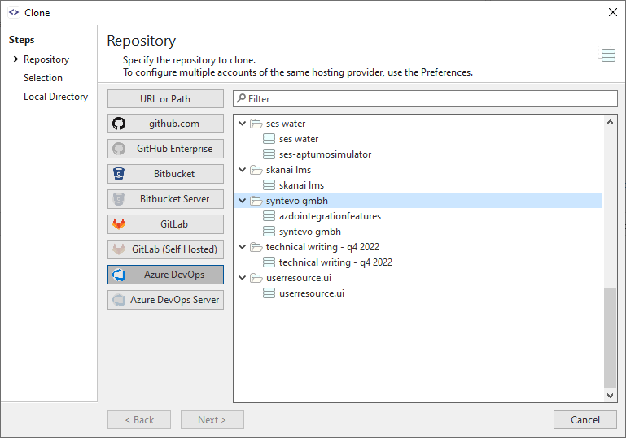

# Integrated Cloning

Once [integration](index.md) with a repository hosting provider has been configured, SmartGit's **Clone** command will allow navigation to browse repositories available to you on the hosting provider.
The required repository can then be **Selected** and **Cloned**, without needing to copy the Clone URL from the hosting provider and paste it into SmartGit.

SmartGit will display repositories on the hosting provider to which it has been granted access, including:

- *User* repositories
- *Organization* (org) repositories

## Example
> [!EXAMPLE]
> In the diagram below, the SmartGit user has configured integrations with multiple hosting providers and has selected the *Azure DevOps* icon.
> A list of repositories available to the user on Azure DevOps is displayed beneath each organizational folder:

