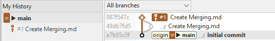
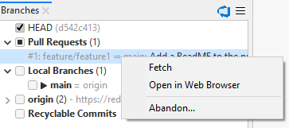
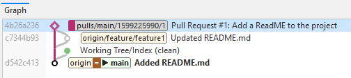

# Integrated Pull Requests

If a repository has been cloned from, and integrated to an [integrated Hosting Provider](index.md) such as GitHub, when SmartGit detects changes on the hosting service, 
it will also refresh information on related Pull Requests (PRs) from the remote.

## Summary of Pull Requests features in SmartGit

The following features summarize the integrated features available directly within SmartGit, without having to interact with the Pull Request on the Hosting Provider.

- In the [**Standard Window**](#additional-pr-features-in-the-standard-window-currently-available-for-github-only):
  - Pull Requests which have been created by you, or assigned to you, will be displayed with an Outbound or Inbound icon, respectively.
  - A *Virtual Merge Commit* representing the outcome of the PR will allow you to to view changed files in the **Files View** and **Changes View**.
  - The ability to Approve an incoming Pull Request, without providing further feedback (to leave feedback, use commenting, in the **Log Window**)
- In the [**Working Tree Window**](#additional-pr-features-in-the-working-tree-window) and **Log Window**
  - Clicking on the Hosting Provider *Icon* will check for new branches and Pull Requests on the remote.
- In the [**Log Window**](#additional-pr-features-in-the-log-window)
  - The *Branches View* will show available Pull Requests.
  - A *Virtual Merge Commit* representing the outcome of the PR will allow you to to view changed files in the **Files View** and **Changes View**.
  - The ability to view, edit, and create comments on the Pull Request
  - The ability to Merge or Reject the pull request

## Creating a Pull Request
After pushing commits to a remote branch, you may want to create a Pull Request on the remote by using the Hosting Provider's custom web user interface.

With integration enabled, SmartGit provides linked shortcuts to create the Pull Request:
- In the **Branch View** of the **Log Window**, by clicking on the pushed branch under the remote folder, OR clicking on the locally tracked branch, and selecting *Create Pull Request*.
- In the **My History View** of the **Standard Window**, by clicking on the pushed branch, and select *Create Pull Request*.
  If you have made commits subsequent to pushing the branch to the remote, SmartGit will prompt you to push the new commits before proceeding with creating the Pull Request.

## Additional PR features in the Standard Window (Currently Available for GitHub only)

Additional functionality is available in the **Standard Window** when a repository is [integrated to GitHub](GitHub-integration.md), and where a PR has been created by you, or assigned to you.
When SmartGit detects that you are involved in a PR, an Icon will be shown in the *My History* area, as well as in the *Graph View*:

- *Incoming* pull requests are those which other users have created and assigned to you.
  On the commit, the icon below displayed, along side the hosting provider's PR reference identifier.

- *Outgoing* pull requests are those which you have initiated to other users/repositories, requesting them to merge your changes.
  On the commit, the icon below is displayed alongside the hosting provider's PR reference identifier.
  

Clicking on PR icon will allow you to open the PR in GitHub, and wil also allow you to Approve an incoming Pull Request, without providing further feedback (to leave feedback, use the advanced Commenting review features, in the **Log Window**)

## Additional PR features in the Working Tree window

The Working tree window contains a light-weight GitHub integration at the top of the **Branches** view:
- A *Pull Requests* link which will take you to the **Log Window**, where the PRs will be shown.
- An icon showing the Hosting Provider connected to this repository. Clicking on the Icon will refresh the state of remote branches and pull requests.
- In the **Working Tree Window**, if open PR's are present, a hyperlink will be shown taking you to the PR on the *Branches View* of the **Log Window**

#### Note

> Detailed pull request information and operations on pull requests are only available in the **Log** (see below).

## Additional PR features in the Log Window

When integrated to a repository, *Log* window of your repository, you can interact with Pull Requests in the following ways:

- Above the **Branches View**, a hosting provider specific icon will appear. Clicking on the icon will force a refresh of PR and branch information from the server.
- To create a pull request, click on a branch and use **Create Pull Request** from the context menu of the **Branches** view.
- On the **Log Window**, the *Branches View* will show available Pull Requests:

- To work with the PR on the Hosting Provider web site, click on the Pull Request to open the context menu, and select *Open in Web Browser*
- To work with these pull requests locally in SmartGit (e.g. to review their commits, or Merge or Reject them):
  - the commits in the PR can be fetched by invoking *Fetch* from the context menu of the pull request. 
  - This will fetch all commits from the remote repository to a special branch in your local repository and will create an additional, *Virtual Merge Commit* between the base commit from which the pull request has been forked and the latest (remote) pull request commit.
  - The virtual merge commit is represented by a diamond icon in the *Graph View* of the **Log Window**.

  - Clicking on the *Virtual Merge Commit* in the *Graph View* of the **Log Window** will allow you to view the result of the PR in the *Files View* and the [*Compare View*](../GUI/Compare-View.md) as per any normal commit.
  - You can remove the local *Virtual Merge Commit* by using the *Drop Local* command by either clicking on the Pull Request in the *Branches View*, or clicking on the diamond icon in the *Graph View*.

### Reviewing a Pull Request from within the SmartGit Log Window

In addition to using the Hosting Provider's standard Pull Request review features by using *Open in Web Browser*, it is also possible to review Pull Requests directly in SmartGit, viewing, adding, and editing comments on the PR.

In addition, when the repository is integrated to the Hosting Provider, the **Files View** of the **Log Window** will show comments in the PR. 

Please refer to [integrated comments](Integrated-Comments.md) for detailed information with viewing, adding or editing comments.

#### Technical note on the Synchronization between SmartGit and Pull Requests on the remote Server

**When does SmartGit detect Pull Requests?**
- When initially loading the Log, SmartGit will also refresh information on related *Pull Requests* from the GitHub server.
- When a user performs a Fetch or Pull from the remote
- When the user clicks on the GitHub/AzureDevOps/BitBucket icons 

**When does SmartGit synchronize Pull Requests?**
*Incoming* pull requests, in first place, are just present on the server.
SmartGit learns about them only by calling a GitHub REST API and displays the retrieved information in the **Branches**. 
To work with these pull requests (e.g. to review their commits, or **Merge** or **Reject** them), you first have to fetch them by invoking **Fetch** from the context menu of the pull request. 
This will fetch all commits from the remote repository to a special branch in your local repository and will create an additional, virtual *merge* commit between the *base* commit from which the pull request has been forked and the latest (remote) pull request commit.

When selecting this *merge* node in the **Commits** view, you can see the entire changes which a multi-commit pull request includes and you can [comment](#comments) on these changes, if necessary. After commenting changes, it's probably a good idea to **Reject** the pull request to signal the initiator of the pull request, that modifications are required before you are willing to pull his changes. If you are fine with a pull request, you may **Merge** it. This will request the GitHub server to merge the pull request and then SmartGit will pull the corresponding branch, so you will have the merged changes locally available.

*Outgoing* pull requests can be **Fetch**ed as well, however this is usually not necessary, as the pull request belongs to you and it contains your own commits. If you decide that you want to take a pull request back, use **Reject**.

For a pull request which had been fetched once, there was a special *ref* created which will make it show up in the **Pull Requests** category, even if it is not present on the server anymore. In this case, you may use **Drop Local** on such a pull request to get rid of the corresponding ref, the local merge commit, all other commits of the pull request and the entry in **Pull Requests** as well. It's safe to use **Drop Local**, as it will only affect the local repository and you can re-fetch a pull request anytime you like using **Fetch** again.

You can invoke **Review \| Sync** to manually update the displayed information. 
Usually you will want to do that, if you know that server-side information has changed since the Log has been opened.

