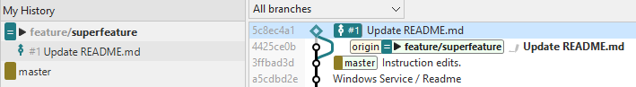

# Integrated Pull Requests

If a repository has been cloned from an [integrated Hosting Provider](index.md), when SmartGit detects changes on the hosting service, 
it will also refresh information on related Pull Requests (PRs) from the remote.

## Creating a Pull Request
After pushing commits to a remote branch, you can create a Pull Request between this branch and another branch on the remote by using the Hosting Provider's custom Pull Request user interface.

With repository integration enabled, SmartGit provides linked shortcuts to create the Pull Request:
- In the **Branch View** of the **Log Window**, by clicking on the pushed branch under the remote folder, OR clicking on the locally tracked branch, and selecting *Create Pull Request*.
- In the **My History View** of the **Standard Window**, by clicking on the pushed branch, and select *Create Pull Request*.
  If you have made commits subsequent to pushing the branch to the remote, SmartGit will prompt you to push the new commits before proceeding with creating the Pull Request.

## Working with Pull Requests in SmartGit
- In the **Standard Window** and **Log Window**, clicking on the Hosting Provider *Icon* will check for new branches and Pull Requests on the remote.
- In the **Standard Window**, if open PR's are present, a hyperlink will be shown taking you to the PR on the *Branches View* of the **Log Window**
- On the **Log Window**, the *Branches View* will show available Pull Requests:

  
  - To work with the PR on the Hosting Provider web site, click on the Pull Request to open the context menu, and select *Open in Web Browser*
  - To work with these pull requests locally in SmartGit (e.g. to review their commits, or Merge or Reject them), the commits in the PR can be fetched by invoking *Fetch* from the context menu of the pull request. 
  This will fetch all commits from the remote repository to a special branch in your local repository and will create an additional, *Virtual Merge Commit* between the base commit from which the pull request has been forked and the latest (remote) pull request commit.
  The virtual merge commit is represented by a diamond icon in the *Graph View* of the **Log Window**.

You can remove the local *Virtual Merge Commit* by using the *Drop Local* command by either clicking on the Pull Request in the *Branches View*, or clicking on the diamond icon in the *Graph View*.

## Reviewing a Pull Request within SmartGit
Although it is possible to use the Hosting Provider's Pull Request review features by using *Open in Web Browser*, it is also possible to review Pull Requests in SmartGit.

Once a PR has been [fetched](#working-with-pull-requests-in-smartgit), clicking on the *Virtual Merge Commit* in the *Graph View* of the **Log Window** will allow you to view the result of the PR in the *Files View* and the [*Compare View*](../GUI/Compare-View.md) as normal.

In addition, when the repository is integrated to the Hosting Provider, in the **Log Window**:
- A list of comments will be shown in the **Files View**. Selecting a comment allows you to:
  - *Jump To* the comment, by showing the comment at the applicable location in the reviewed file in the **Compare View**.
  - *Edit* or *Delete* a comment (if the comment was created by yourself)
  - *Reply To* the comment. SmartGit will prompt you for a reply message.

## Additional Functionality (Currently Available on GitHub only)

Additional functionality is available in the **Standard Window** when a repository is [integrated to GitHub](../GitHub-integration.md), and where a PR has been created or assigned to you, or where a review has been requested of you.

- *Incoming* pull requests are those which other users have assigned to you for review and/or merging.
  These are displayed in a separate *Pull Requests* folder under the Branches view.
  On the commit, an upward arrow icon is displayed, along side the hosting provider's PR reference identifier.

- *Outgoing* pull requests are those which you have initiated to other users/repositories, requesting them to merge your changes.
  These are displayed directly below the local (or if it does not exist), the remote branch in the *Branches View*.

#### Incoming Pull Requests
When SmartGit detects an Incoming pull request assigned to you for merge or review

When selecting this merge node in the Commits view, you can see the entire changes which a multi-commit pull request includes and you can comment on these changes, if necessary.

